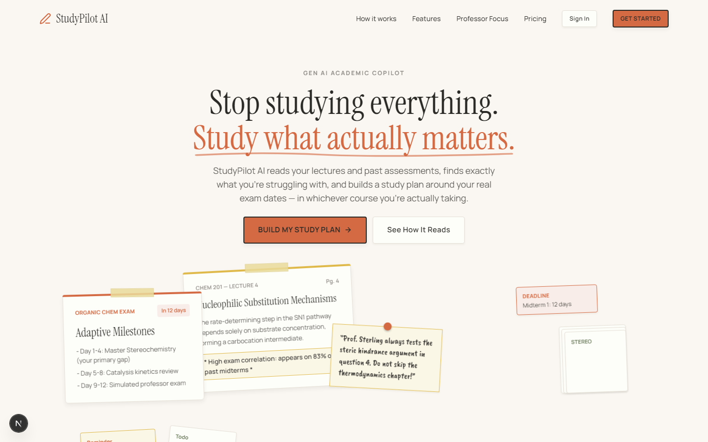

# StudyPilot AI

An AI-powered study companion built as a full-stack web app. It ingests material a student
provides, runs it through an AI analysis pipeline, and turns the results into a personalized,
adaptive experience across dashboards, assessments, and a study planner — with an accessibility
layer that adapts the interface itself to how each learner works best.

> The product concept, analysis pipeline, and scoring/recommendation logic are intentionally not
> detailed in this document.



## Tech stack

- **Framework:** Next.js 16 (App Router, Turbopack) · React 19 · TypeScript
- **Styling/UX:** Tailwind CSS v4 · Framer Motion · lucide-react
- **Data:** MongoDB Atlas
- **AI:** Server-side LLM integration (keys never reach the client)
- **Auth/session:** Anonymous secure session cookies via `jose`
- **Document processing:** PDF/DOCX/image ingestion with OCR fallback
- **Testing:** Vitest

## Getting started

Requires Node.js 18.18+ (Node 20 LTS recommended).

```bash
npm install
npm run dev
```

Open [http://localhost:3000](http://localhost:3000).

Copy `.env.example` to `.env.local` and fill in the required server-only keys before using live
AI features. Environment variables are read only by server routes and are never exposed to the
browser. If a key is missing, the app falls back to safe, clearly-bounded demo behavior instead of
failing.

For a production build:

```bash
npm run build
npm start
```

## Scripts

| Command | Description |
|---|---|
| `npm run dev` | Start the local development server |
| `npm run build` | Build for production |
| `npm start` | Run the production build |
| `npm run lint` | Lint the codebase |
| `npm test` | Run the test suite |
| `npm run seed` | Seed local/demo data |

## Deployment

Designed to deploy on Vercel with MongoDB Atlas as the persistence layer. Configure the required
environment variables in your hosting provider's dashboard — never prefix provider/secret keys
with `NEXT_PUBLIC_`, as that would expose them to the browser.

## Project structure

```
app/          Next.js App Router pages and API routes
components/   UI components, organized by feature area
lib/          Core application logic and integrations
scripts/      Local tooling (dev environment, seeding)
public/       Static assets
```

## License

Private project — all rights reserved.
